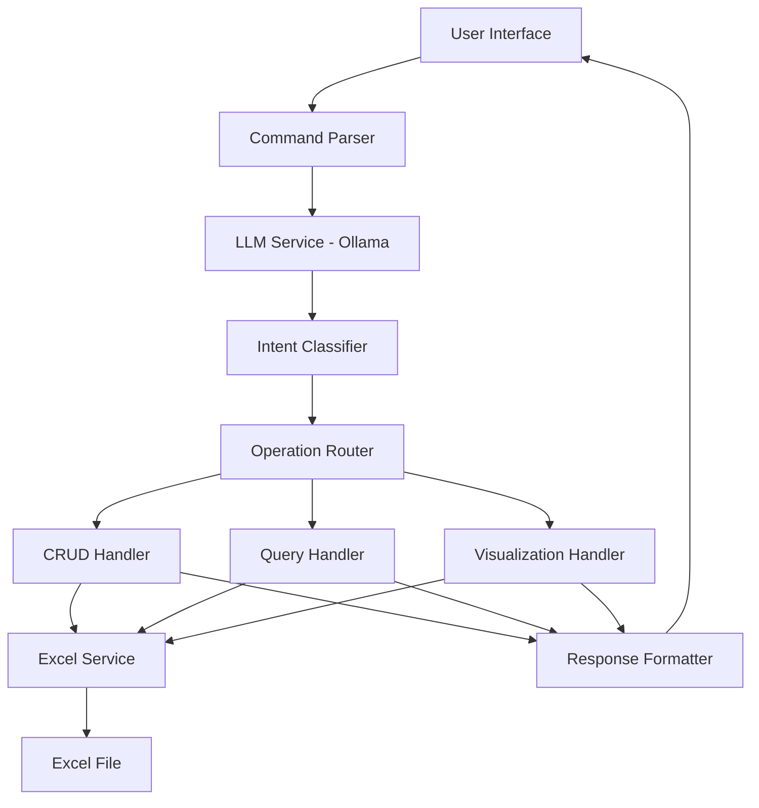

# Design Document

## Overview

The Excel-LLM Integration Tool is a Python-based application that bridges natural language processing with Excel file manipulation. The system uses Ollama with the mistral:7b-instruct model to interpret user commands and translate them into programmatic Excel operations. The architecture emphasizes local processing, data privacy, and seamless integration between conversational AI and spreadsheet functionality.

## Architecture

### High-Level Architecture



### Core Components

1. **LLM Service Layer**: Manages communication with Ollama/mistral:7b-instruct
2. **Command Processing Layer**: Parses and classifies natural language commands
3. **Operation Layer**: Handles specific CRUD, query, and visualization operations
4. **Excel Service Layer**: Manages file I/O and spreadsheet manipulation
5. **User Interface Layer**: Provides command input and response display

## Components and Interfaces

### 1. LLM Service (Ollama Integration)

**Purpose**: Interface with local Ollama instance running mistral:7b-instruct

**Role of LLM**: The LLM serves as a natural language interpreter that converts user commands into structured operation parameters. It does NOT execute operations directly but outputs structured JSON that drives template-based command execution.

**LLM Output Format**:
```json
{
  "intent": "chart_modify|data_transform|create|read|update|delete",
  "operation": "shift_axis|transform_values|insert_data|query_data|...",
  "parameters": {
    "target": "chart_1|data_range|specific_cells",
    "axis": "x|y|both",
    "shift_amount": 0.5,
    "transform_function": "subtract",
    "transform_value": 1,
    "safety_level": "safe|caution|dangerous"
  },
  "confirmation_required": true|false,
  "risk_assessment": "low|medium|high"
}
```

**Key Methods**:
- `initialize_connection()`: Establish connection to Ollama
- `parse_to_structured_command(prompt: str)`: Convert natural language to structured JSON
- `assess_command_safety(command: str)`: Evaluate potential risks
- `generate_confirmation_prompt(operation: dict)`: Create user confirmation messages

**Configuration**:
- Model: mistral:7b-instruct
- Temperature: 0.1 (for consistent, deterministic responses)
- Max tokens: 1000
- Local endpoint: http://localhost:11434

**Sample Queries Supported**:
1. "Left shift graph by 0.5 in X-Axis" → `{"intent": "chart_modify", "operation": "shift_axis", "parameters": {"axis": "x", "shift_amount": 0.5}}`
2. "Reduce all Y values by 1" → `{"intent": "data_transform", "operation": "transform_values", "parameters": {"axis": "y", "transform_function": "subtract", "transform_value": 1}}`
3. "Create a bar chart from sales data" → `{"intent": "visualize", "operation": "create_chart", "parameters": {"chart_type": "bar", "data_source": "sales"}}`
4. "Delete all rows where status is 'inactive'" → `{"intent": "delete", "operation": "conditional_delete", "parameters": {"condition": "status == 'inactive'"}}`

### 2. Command Parser

**Purpose**: Process natural language commands and extract structured information

**Key Methods**:
- `parse_command(user_input: str)`: Main parsing entry point
- `validate_command(parsed_command: dict)`: Ensure command completeness
- `suggest_clarification(incomplete_command: dict)`: Generate clarifying questions

**Command Structure**:
```python
{
    "intent": "create|read|update|delete|visualize",
    "target": "data|chart|table",
    "parameters": {
        "columns": [],
        "values": [],
        "conditions": [],
        "chart_type": "",
        "sheet_name": ""
    }
}
```

### 3. Excel Service

**Purpose**: Handle all Excel file operations and data manipulation

**Key Methods**:
- `load_workbook(file_path: str)`: Load Excel file
- `create_backup()`: Create timestamped backup before any operation
- `analyze_structure()`: Detect headers, data types, sheet structure
- `execute_crud_operation(operation: dict)`: Perform CRUD operations
- `query_data(query_params: dict)`: Execute data queries
- `create_visualization(viz_params: dict)`: Generate charts and plots
- `save_workbook()`: Save changes to file
- `restore_from_backup(backup_path: str)`: Restore from backup if needed

**Backup Strategy**:
- Automatic backup before EVERY operation (not just destructive ones)
- Timestamped backup files: `filename_backup_YYYYMMDD_HHMMSS.xlsx`
- Configurable backup retention (default: keep last 10 backups)
- Backup location: `./backups/` directory

**Supported Formats**: .xlsx, .xls, .csv

### 4. Template-Based Command Execution System

**Architecture**: The system uses a template-based approach where the LLM outputs structured JSON that maps to predefined operation templates.

**Execution Flow**:
1. LLM converts natural language → Structured JSON
2. JSON parameters map to operation templates
3. Templates execute specific Excel operations
4. Results formatted and returned to user

**Operation Templates**:
```python
OPERATION_TEMPLATES = {
    "chart_modify": {
        "shift_axis": lambda chart, axis, amount: chart.shift_axis(axis, amount),
        "transform_values": lambda chart, axis, func, value: chart.transform_data(axis, func, value)
    },
    "data_transform": {
        "subtract_values": lambda range, value: range.apply(lambda x: x - value),
        "multiply_values": lambda range, value: range.apply(lambda x: x * value)
    },
    "create": {
        "insert_row": lambda sheet, data: sheet.insert_row(data),
        "add_column": lambda sheet, name, values: sheet.add_column(name, values)
    }
}
```

**Dynamic Template System**:
To address extensibility concerns, the system includes a dynamic template loading mechanism that automatically updates LLM prompts:

```yaml
# templates/operations.yaml
chart_operations:
  shift_axis:
    parameters: [chart_id, axis, amount]
    function: "chart_operations.shift_axis"
    safety_level: "safe"
    intent_keywords: ["shift", "move", "offset", "translate"]
    examples: ["shift chart left by 2", "move graph right 0.5 units"]
  
  new_operation:  # Can be added without code changes
    parameters: [chart_id, new_param]
    function: "chart_operations.new_function"
    safety_level: "medium"
    intent_keywords: ["new", "custom", "special"]
    examples: ["apply new operation to chart", "use custom function"]

data_operations:
  transform_values:
    parameters: [range, operation, value]
    function: "data_operations.transform"
    safety_level: "safe"
    intent_keywords: ["transform", "modify", "change", "apply"]
    examples: ["subtract 5 from all values", "multiply column by 2"]
```

**Dynamic LLM Prompt Generation**:
The system automatically generates LLM prompts based on available operations:

```python
def generate_llm_prompt():
    operations = load_operations_config()
    
    prompt = """
    You are an Excel operation classifier. Based on the user command, 
    return JSON with intent and parameters.
    
    Available operations:
    """
    
    for category, ops in operations.items():
        for op_name, op_config in ops.items():
            prompt += f"""
            - {op_name}: {', '.join(op_config['intent_keywords'])}
              Examples: {', '.join(op_config['examples'])}
              Parameters: {op_config['parameters']}
            """
    
    return prompt + """
    
    Return JSON format:
    {"intent": "operation_name", "parameters": {...}, "safety_level": "safe|medium|high"}
    """
```

**Template Management**:
- **Configuration-Based**: New operations defined in YAML/JSON config files
- **Hot Reload**: Templates can be added/modified without restarting the application
- **Plugin Architecture**: New operation modules can be loaded dynamically
- **Safety Validation**: Each new template must specify safety level and parameters

**Adding New Commands Process**:
1. Define operation in `templates/operations.yaml` with:
   - Function parameters and implementation
   - Safety level classification
   - **Intent keywords** for LLM recognition
   - **Example phrases** for LLM training
2. Implement function in appropriate module (e.g., `chart_operations.py`)
3. System automatically:
   - Loads new template on next startup (or hot reload)
   - **Regenerates LLM prompt** with new operation examples
   - **Updates intent classification** to recognize new commands

**LLM Intent Auto-Update**:
- LLM prompts are dynamically generated from operation configs
- New operations automatically become available to LLM
- No manual prompt engineering required for new commands
- Intent keywords and examples guide LLM classification

**Benefits of Dynamic Template Approach**:
- **Full Extensibility**: Add new operations without ANY code changes to core system
- **Automatic LLM Updates**: LLM prompts automatically include new operations
- **Self-Documenting**: Operation configs serve as both implementation and LLM training
- **Safety**: Predefined operations prevent arbitrary code execution
- **Consistency**: Standardized operation patterns
- **Maintainability**: Configuration-driven operation and intent management
- **Performance**: No runtime code generation or interpretation

### 5. Operation Handlers

#### CRUD Handler
- **Create**: Insert new rows/data based on natural language specifications
- **Read**: Query and retrieve data with filtering and aggregation
- **Update**: Modify existing data with validation
- **Delete**: Remove data with confirmation prompts

#### Query Handler
- Support for filtering (`WHERE` equivalent operations)
- Aggregation functions (SUM, AVG, COUNT, etc.)
- Sorting and grouping operations
- Cross-sheet references

#### Visualization Handler
- Chart type detection based on data characteristics
- Support for: bar charts, line charts, pie charts, scatter plots, histograms
- **Chart Manipulation**: Move, resize, and modify existing charts
- **Axis Operations**: Shift data along X/Y axes, modify scales and ranges
- **Data Transformation**: Apply mathematical operations to chart data (e.g., Y-new = Y-old - 1)
- Automatic axis labeling and formatting
- Integration with Excel's native charting capabilities

## Data Models

### Command Model
```python
@dataclass
class Command:
    intent: str
    target: str
    parameters: Dict[str, Any]
    confidence: float
    sheet_name: Optional[str] = None
    
    def validate(self) -> bool:
        # Validation logic
        pass
```

### Excel Structure Model
```python
@dataclass
class ExcelStructure:
    sheets: List[str]
    headers: Dict[str, List[str]]
    data_types: Dict[str, Dict[str, str]]
    row_count: Dict[str, int]
    
    def get_sheet_info(self, sheet_name: str) -> Dict:
        # Return sheet-specific information
        pass
```

### Operation Result Model
```python
@dataclass
class OperationResult:
    success: bool
    message: str
    affected_rows: int
    data: Optional[Any] = None
    chart_reference: Optional[str] = None
```

## Error Handling

### LLM Connection Errors
- **Ollama Unavailable**: Provide clear instructions for starting Ollama service
- **Model Not Found**: Guide user to download mistral:7b-instruct model
- **Timeout Errors**: Implement retry logic with exponential backoff

### Excel File Errors
- **File Not Found**: Prompt user to specify correct file path
- **Permission Errors**: Check file access and suggest solutions
- **Corrupted Files**: Attempt recovery or suggest file repair tools
- **Unsupported Formats**: Convert or suggest compatible alternatives

### Command Processing Errors
- **Ambiguous Commands**: Generate clarifying questions
- **Invalid Operations**: Explain why operation cannot be performed
- **Data Validation Errors**: Provide specific feedback on data issues

### Data Operation Errors
- **Type Mismatches**: Suggest data conversion or correction
- **Constraint Violations**: Explain Excel limitations and alternatives
- **Reference Errors**: Help user correct cell/range references

## Testing Strategy

### Unit Testing
- **LLM Service**: Mock Ollama responses for consistent testing
- **Command Parser**: Test various natural language inputs and edge cases
- **Excel Service**: Test CRUD operations on sample spreadsheets
- **Operation Handlers**: Validate each operation type independently

### Integration Testing
- **End-to-End Workflows**: Test complete user scenarios from command to result
- **File Format Compatibility**: Test with various Excel file types and structures
- **LLM Integration**: Test actual Ollama communication with different prompts

### Performance Testing
- **Response Time**: Measure command processing and execution speed
- **Memory Usage**: Monitor memory consumption with large Excel files
- **Concurrent Operations**: Test multiple simultaneous operations

### User Acceptance Testing
- **Natural Language Variety**: Test with diverse command phrasings
- **Real-World Scenarios**: Use actual user spreadsheets and workflows
- **Error Recovery**: Test system behavior with invalid or unclear commands

## Security and Privacy Considerations

### Local Processing
- All data processing occurs locally using Ollama
- No external API calls or data transmission
- Excel files remain on local filesystem

### Data Validation
- Input sanitization for all user commands
- Excel formula injection prevention
- File path validation to prevent directory traversal

### Access Control
- File permission checks before operations
- Backup creation before destructive operations
- User confirmation for delete operations

### Dangerous Command Protection

**Risk Assessment System**:
- **Low Risk**: Read operations, single cell updates, simple queries
- **Medium Risk**: Multiple row operations, chart modifications, formula changes
- **High Risk**: Format operations, delete operations, structural changes

**Dangerous Command Examples and Protections**:
1. **"Format all"** → **BLOCKED**
   - System response: "This operation is not allowed as it would affect the entire spreadsheet formatting. Please specify a specific range or cells to format."
   - Operation is completely prevented, no confirmation option

2. **"Delete everything"** → **BLOCKED**
   - System response: "Mass deletion operations are not permitted for safety. Please specify exact rows, columns, or conditions for deletion."
   - Operation is completely prevented, no confirmation option

3. **Mass Operations** → Scope-limited
   - Operations affecting >50 rows are automatically blocked
   - System suggests breaking down into smaller, specific operations
   - No override options for mass operations

**Safety Mechanisms**:
- **Command Blocking**: Dangerous operations are completely prevented
- **Scope Limitations**: Hard limits on operation scope (max 50 rows/columns per operation)
- **Automatic Backups**: Create timestamped backups before EVERY operation (not just destructive ones)
- **Operation Logging**: Track all operations for audit and rollback
- **Whitelist Approach**: Only explicitly safe operations are allowed

## Performance Optimization

### LLM Efficiency
- Prompt optimization for faster inference
- Response caching for repeated similar commands
- Batch processing for multiple operations

### Excel Operations
- Lazy loading for large spreadsheets
- Efficient data structure updates
- Minimal file I/O operations

### Memory Management
- Stream processing for large datasets
- Garbage collection optimization
- Resource cleanup after operations